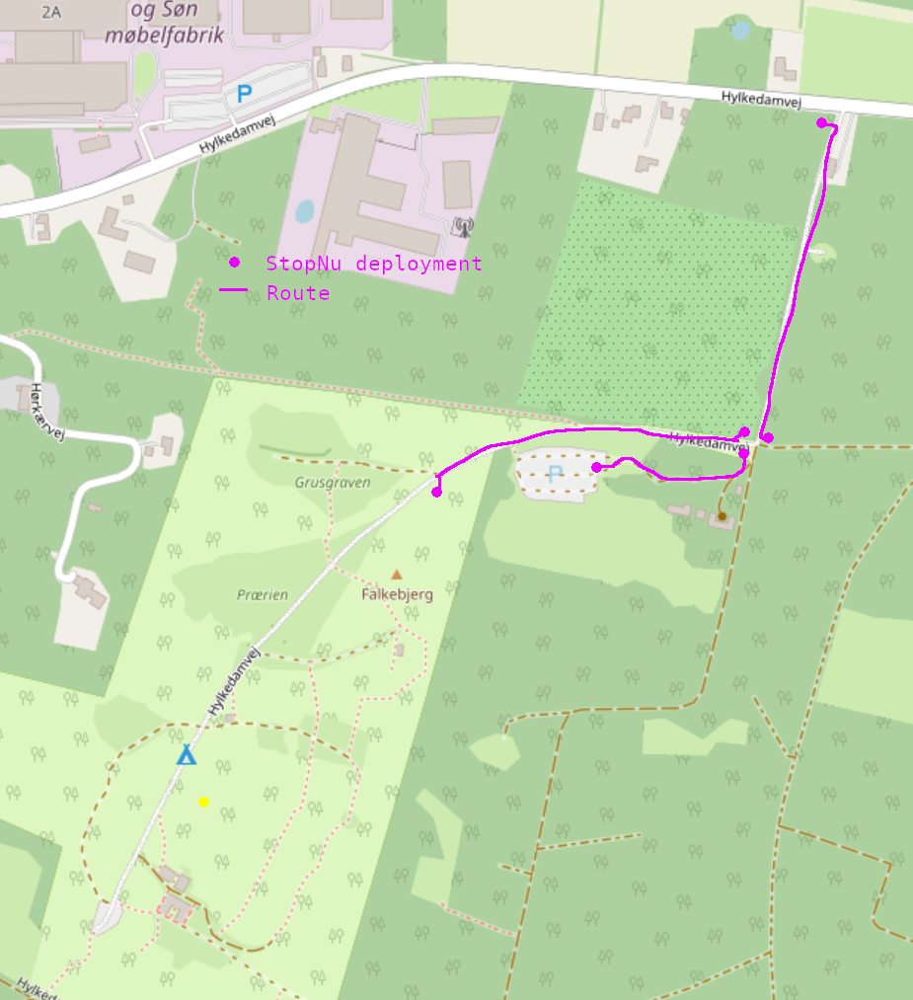

# StopNu project requirements

# Introduction

This document describes the requirements for the StopNu project for the
Bornhack hacker festival. This project consists of 6 traffic light shaped units
to steer traffic accros narrow muddy roads towards the festival terrain and
parking lot from the main road.

The rationale for this project comes from the limited access for motorized
vehicles towards the terrain at Hylkedamvej. It basically only allows for one
way traffic and we want to automate the flow of traffic. This yearly festival
occurs in July and has around 400 visitors. 

The organization of Bornhack has aqcuired 2 traffic lights, which have been 
separated into 6 single light enclosures. These will house new electronics and 
LED lighting circuits. They will also need to communicate over a distance of 
around 300 m. through forested and slightly hilly terrain. 
Due to the large distance, the units shall be battery powered. 

# Writing process used 
The requirements are discussed in this project view.
https://github.com/orgs/badgeteam/projects/12/views/1

This document aggregates all the design decissions into a coherent whole. 
For local checking the program `ghostwriter` can interpret this Markdown 
document.

# Project deployment

BornHack 20XX: design and implementation of traffic control measures on the
roads outside the venue. This concerns:

 *  Hylkedamvej main road to junction
 *  junction to parking area
 *  junction to main gate

Traffic lights at each end of these sections work as a pair, and a selectable
'ganged' mode could be beneficial when high inflow or outflow is expected.
(example: junction->parking and junction->gate get green when road->junction
gets green)

# Operation / logistics aspects

# Used Units

## Traffic lights

## Traffice light Enclosure 

## LED board

## Control Board

## Ambient light sensor

Open Issue:   
Visible in bright sunlight #7  
https://github.com/badgeteam/stopnu-hardware/issues/7

### Wire harnesses internal to traffic light

### Wire harnesses external to and from battery

## Mounting pole

## Battery and enclosure

Open Issue: 

https://github.com/badgeteam/stopnu-hardware/issues/1

## Battery chargers

Open Issue: When a battery pack is chosen, one or more chargers need to be
available. 

## Control box

# Behaviour and Software

Loadable display patterns: https://github.com/badgeteam/stopnu-firmware/issues/3

Technical aspects:

    Requirements:

    Battery powered (Makita 18V?) -> 10S7P LiPo battery units have been offered by Dennis in signal:BH20XX_Traffic_Control
    Wireless (LoRaWan?)
    Visible in bright sunlight
    IP44 rated enclosures
    Fallback to dumb mode (X minutes green #1, Y minutes red #1 and #2, X minutes green #2 ...) on central comms or sensor failure
    Ambient light level sensor to reduce brightness at night # was 'nice to have', promoted to 'required'
    Loadable display patterns. # was 'nice to have', promoted to 'required'
    Tilt sensor, to report the unit has fallen over or is being (re)moved.
    Single, pole-mountable unit (excluding batteries)

    Nice to have:

    Autonomous detection of vehicles, fallback to "Press This Button". Minimal false triggers on non-car/truck vehicles (bikes, deer, snails etc.)
    Multiple vehicle-detection methods
    Local status screen 
   

Operational/logistical aspects:

    Requirements:   

    Freely placeable
    Easily storable (with the shade hood removed 3 can fit in a 60x40x40 Eurobox)
    Central monitoring (vehicles detected, battery state) and control (emergency/utility vehicle or BH shuttle in/out NOW)

    Nice to have:

    state report to BH infra map
    portable auxiliary controller to assist pacing traffic between camp and parking during start or finish of camp

Legal and organisational aspects:

    Should sufficiently look like a traffic light that people will act on the signal; should not be mistaken 
        for an official one -> single-light units w. WS2812-based panels?. -> wait/go display based on patterns as well as
        colours to accomodate R/G colourblindness
    Minimise obstruction of normal traffic by vehicles turning off from main road towards junction/venue ->
        create waiting area at layby 200m before turnoff?
    Explanatory text on attached laminated paper
    Explanatory text in BH ticket?
